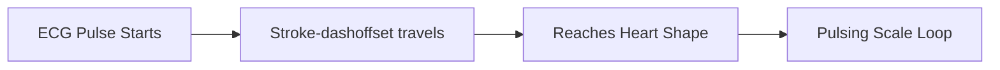

# External Resources Analysis & Integration Plan

We have analyzed the 7 external projects in the `Source/` folder. Each folder contains high-quality, creative frontend interactions (interactive SVGs, canvas physics, 3D CSS structures, and cursor tracking).

Below is a detailed analysis of each feature and a proposal for how they can be elegantly integrated into the **Happy Birthday Srividya** project to make it look state-of-the-art and incredibly interactive.

---

## 1. Feature Analysis Summary

| Feature Name                     | Key Technology                   | Visual Impact                                                             | Proposed Integration Spot                        |
| :------------------------------- | :------------------------------- | :------------------------------------------------------------------------ | :----------------------------------------------- |
| **Valentine Letter Animation**   | CSS transitions + Cute GIFs      | Folds/unfolds a love letter with interactive yes/no buttons.              | **Landing Page Envelope**                        |
| **Heart Rate Animation 2**       | SVG path length dashoffset       | Draws an animated ECG pulse line that shapes into a beating heart.        | **SceneEffort (Our Journey)**                    |
| **Happy Birthday Cake**          | SVG drawing + CSS Keyframes      | A cake that draws itself from bottom to top; candle drops down and burns. | **New Scene: "Make a Wish" (Before Finale)**     |
| **Animated Firework Diwali**     | HTML5 Canvas + Physics particles | High-performance particle physics simulator with custom shells.           | **Candle Blowout & Finale Backdrop**             |
| **Cursor Trail Image Animation** | Mouse coordinates + DOM Spawning | Floating images fade, rotate, and scale behind the cursor speed.          | **Magical Cursor Trail (Whole Site or Gallery)** |
| **Do You Love Me Code**          | DOM evasion + Video triggers     | Runaway "No" button, heart loader, and video playback upon "Yes".         | **ScenePromise (Interactive Card)**              |
| **CSS 3D Image Carousel**        | CSS 3D transforms + Reflections  | Cylindrical rotating carousel spinning in 3D perspective space.           | **SceneGallery (Interactive memories)**          |

---

## 2. Detailed Integration Designs

### 💌 1. Interactive Opening: Valentine Letter

- **Concept:** Instead of a simple "Open it" button, we will make the landing scene more interactive using the components from the **Valentine Letter Animation** project.
- **Flow:**
  1. The user lands on the envelope. Clicking it opens a window with a cute cat GIF asking, _"I made this for you, will you check it out?"_
  2. If she hovers over **"No"**, the button runs away playfully using the relative angle translation script.
  3. Clicking **"Yes"** triggers a happy dancing cat GIF, plays a chime, and unfolds the letter to transition into the main birthday welcome scene.

### 📈 2. Heartbeat Journey: Heart Rate ECG Line

- **Concept:** Connect the passage of time ("Every second since we met") to a visual heartbeat using the **Heart Rate Animation 2** SVG.
- **Flow:**
  - In the **SceneEffort** section, right above the live ticking counter grid, we will embed the Red ECG SVG path.
  - As the seconds count up, the stroke-dashoffset will animate infinitely, showing a pulse moving across the screen, resolving into a beating pink heart. This visually reinforces the romantic passage of time.

### 🎂 3. Make a Wish: SVG Cake & Candle Blowout

- **Concept:** Integrate the **Happy Birthday Cake** SVG animation as a new interactive scene right before the gallery.
- **Flow:**
  1. As the user scrolls to this section, the cake draws itself using the SVG morphing path animations.
  2. The candle drops from the top and lights up with a flickering flame.
  3. A message says: _"Make a wish, Srividya, and click the candle to blow it out! 🕯️"_
  4. Clicking the candle triggers the blowout: the flame elements fade out, smoke particles appear, and a confetti/firework celebration is triggered immediately.

### 🎆 4. Celebratory Spark: Canvas Fireworks Simulator

- **Concept:** Integrate a lightweight version of the **Animated Firework Diwali** canvas engine to celebrate milestones.
- **Flow:**
  - When the candle is blown out in the Cake section, or when the user scrolls to the **SceneFinale**, we instantiate a background canvas that shoots colorful fireworks into the sky.
  - We will use a optimized React component wrapping the canvas loop, running with `autoLaunch: true` and preset shell parameters to keep the performance buttery smooth on all devices.

### 🪄 5. Magical Dreamscape: Floating Cursor Trail

- **Concept:** Implement the GSAP-style physics tracking from **Cursor Trail Image Animation** to trail small symbols behind her mouse.
- **Flow:**
  - To prevent overloading, we can adapt the trail to spawn a cycling array of tiny icons: glowing hearts, sparkles, stars, or miniature polaroid-frame borders.
  - As she moves her mouse, the elements spawn at cursor coordinates, rotate based on movement speed, and scale down to 0, leaving a trail of magic in her path.

### 💖 6. Unlocking the Confession: Runaway "Do You Love Me?"

- **Concept:** Incorporate the cute confession layout from **Do You Love Me Code** inside the "Promise" or "Gift" coupons.
- **Flow:**
  - When she redeems the _"One Surprise Date"_ or a custom coupon, a hidden card opens: _"Do you love me?"_
  - The "No" button uses the boundary-relative evasion script, making it impossible to click.
  - Clicking "Yes" displays the heart loader, plays a sweet background melody, and loads the romantic confession video (`Love me.mp4`) in a styled Polaroid frame.

### 🎡 7. cylindrical 3D Memory Carousel

- **Concept:** Replace the simple static grid layout of the gallery with the spectacular **CSS 3D Image Carousel**.
- **Flow:**
  - The photos and videos from your gallery config will be mapped to a 3D cylindrical frame.
  - The cylinder rotates slowly in 3D space with perspective shading.
  - Hovering over any photo pauses the rotation, lifts the image forward, adds a glowing gold outline, and reveals a realistic bottom reflection. Clicking the card opens the high-performance media modal we optimized.

---

## 3. Next Steps & Implementation Strategy

To implement these features without cluttering the main routes:

1. **Create Sub-Components:** We will write clean React components for each folder inside the `src/components/special/` directory (e.g. `BirthdayCake.tsx`, `FireworkCanvas.tsx`, `CursorTrail.tsx`, `Carousel3D.tsx`).
2. **Import Styles & Assets:** Migrate the CSS files into dedicated CSS Modules or standard CSS classes in `src/styles.css`, and move GIFs / videos into `public/assets/`.
3. **Sequence Loading:** Ensure that the Firework Canvas and 3D Carousel are only mounted when visible, keeping the site's initial loading speed blazing fast.

**Would you like me to begin implementing these components? Let me know which one you want to start with!**
