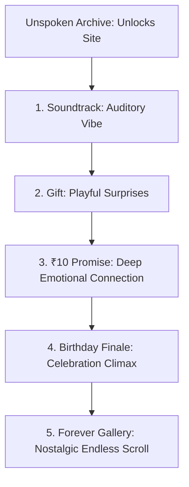

# Implementation Plan — Storytelling Journey & Flow Optimization

This plan analyzes the chronological flow of Srividya's birthday website and proposes a revised order to create a smooth, emotional, and satisfying storytelling journey.

---

## 1. Analysis of the Current Flow

Currently, after Srividya unlocks the page by reading the **Unspoken Archive** letters, the sections appear in this order:

1. **SceneGift** (Interactive Coupon Cards — Playful & Lighthearted)
2. **SceneNote** (The ₹10 Note Union — Deeply Emotional & Nostalgic)
3. **SceneSoundtrack** (The Soundtrack of Us Cassettes — Interactive Music)
4. **SceneFinale** (The Birthday Cake & Blow Candles — Climactic Celebration)
5. **SceneGallery** (Forever Page Photos & Videos — Long-term Memory Wall)

### Tonal Flaws in Current Order:

- **Vibe Interruption**: Unlocking the _Unspoken Archive_ (highly emotional letters) drops Srividya directly into _Gift Coupons_ (gamified/playful), creating a slight emotional jump.
- **Lost Climax**: The _₹10 Promise_ (a deep personal secret) is sandwiched between _Coupons_ and _Cassettes_, diluting its emotional impact.
- **Music Placement**: _The Soundtrack of Us_ sits below the note and coupons. Auditory experiences are best introduced as gateways or transitional points.

---

## 2. Proposed "Crescendo" Journey Order

We propose rearranging the unlocked sections to build a structured emotional narrative arc:



### Why this proposed order creates a better story:

| Step  | Section             | Vibe & Narrative Role                                                                                                                                             |
| :---- | :------------------ | :---------------------------------------------------------------------------------------------------------------------------------------------------------------- |
| **1** | **The Soundtrack**  | **The Auditory Gateway**: Right after unlocking the page, she is greeted with visual cassettes and dedicated music she can play, setting an intimate mood.        |
| **2** | **Gift Coupons**    | **The Playful Promise**: Introduces lighthearted future activities (coupons for dates, letters, movies), making her smile.                                        |
| **3** | **The ₹10 Promise** | **The Emotional Anchor**: Elevates the tone from playful to deeply meaningful by merging the split note halves, creating a moment of pure connection.             |
| **4** | **Birthday Finale** | **The Celebration Climax**: Leads directly from the emotional promise into the peak birthday moment—blowing out the candles and revealing the main birthday wish. |
| **5** | **Forever Gallery** | **The Resting Place**: She completes the journey by landing on the interactive, endless photo & video wall where she can stay and browse old memories.            |

---

## 3. Proposed Code Changes

### Scroll Tracker and Song Mappings

#### [MODIFY] [index.tsx](file:///d:/one-day-start-main/one-day-start-main/src/routes/index.tsx)

- Reorder the section lists in `sceneIds` and adjust `sceneToSongMap` to reflect the new scroll sequence:

```ts
const sceneIds = [
  "welcome",
  "letter",
  "effort",
  "timeline",
  "archive",
  "soundtrack",
  "gift",
  "promise",
  "finale",
  "gallery",
];

const sceneToSongMap: Record<string, number> = {
  welcome: 0,
  letter: 1,
  effort: 2,
  timeline: 3,
  archive: 4,
  soundtrack: 1,
  gift: 0,
  promise: 0,
  finale: 1,
  gallery: 2,
};
```

### Component Rendering Order

#### [MODIFY] [index.tsx](file:///d:/one-day-start-main/one-day-start-main/src/routes/index.tsx)

- Reorder the JSX rendering blocks inside the `allRead` wrapper:

```tsx
{allRead && (
  <motion.div
    initial={{ opacity: 0, y: 30 }}
    animate={{ opacity: 1, y: 0 }}
    transition={{ duration: 1 }}
  >
    {/* 1. Soundtrack */}
    <SceneSoundtrack ... />

    {/* 2. Gift Coupons */}
    <SceneGift />

    {/* 3. ₹10 Promise */}
    <SceneNote />

    {/* 4. Finale (Cake & Wish) */}
    <SceneFinale />

    {/* 5. Forever Gallery (Masonry Grid) */}
    <SceneGallery onVideoPlayStateChange={setIsVideoPlaying} />
  </motion.div>
)}
```

---

## 4. Open Questions & Review Required

> [!IMPORTANT]
>
> - Do you prefer this **crescendo flow** (Soundtrack → Gift → ₹10 Promise → Finale → Gallery), or do you want to keep any specific section in a different spot?
> - Let me know your thoughts so we can adjust or execute the plan!

---

## 5. Verification Plan

- Verify scrolling through sections switches background audio correctly according to the new sequence map.
- Verify page animations load sequentially as she scrolls down the page.
- Compile check using `npm run build`.
